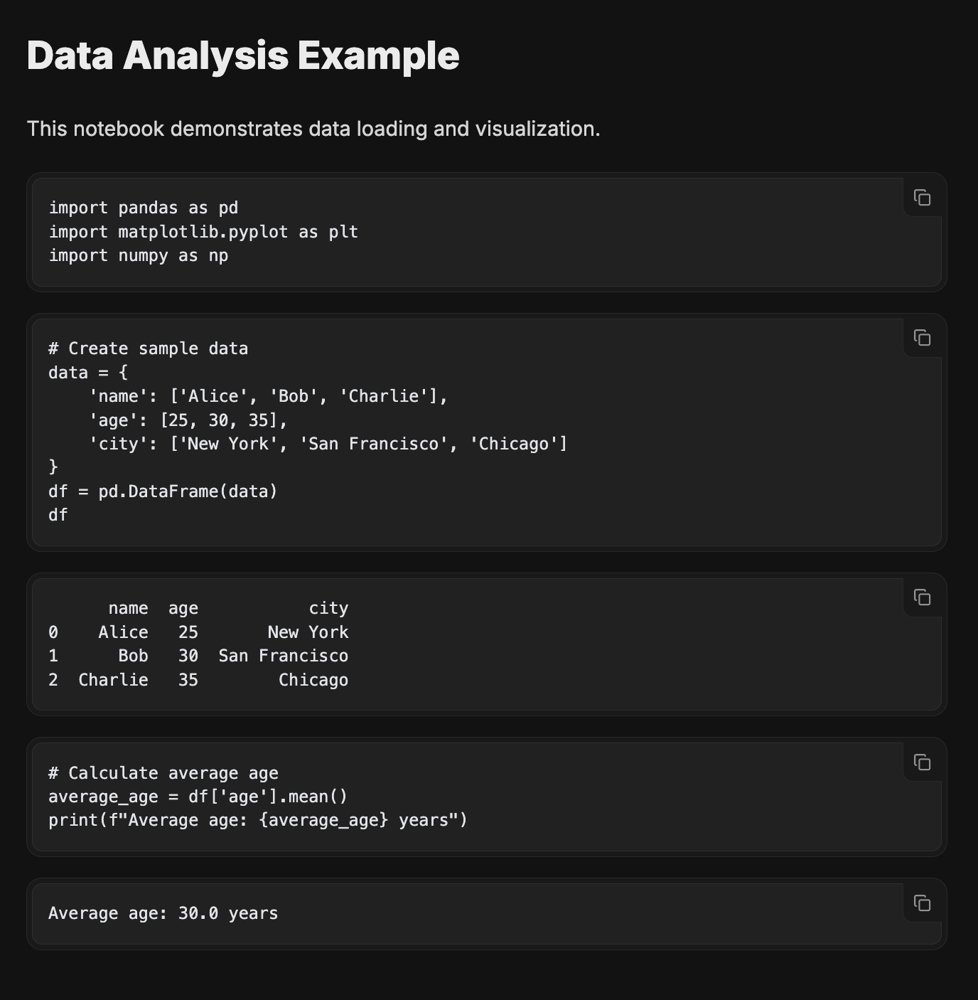
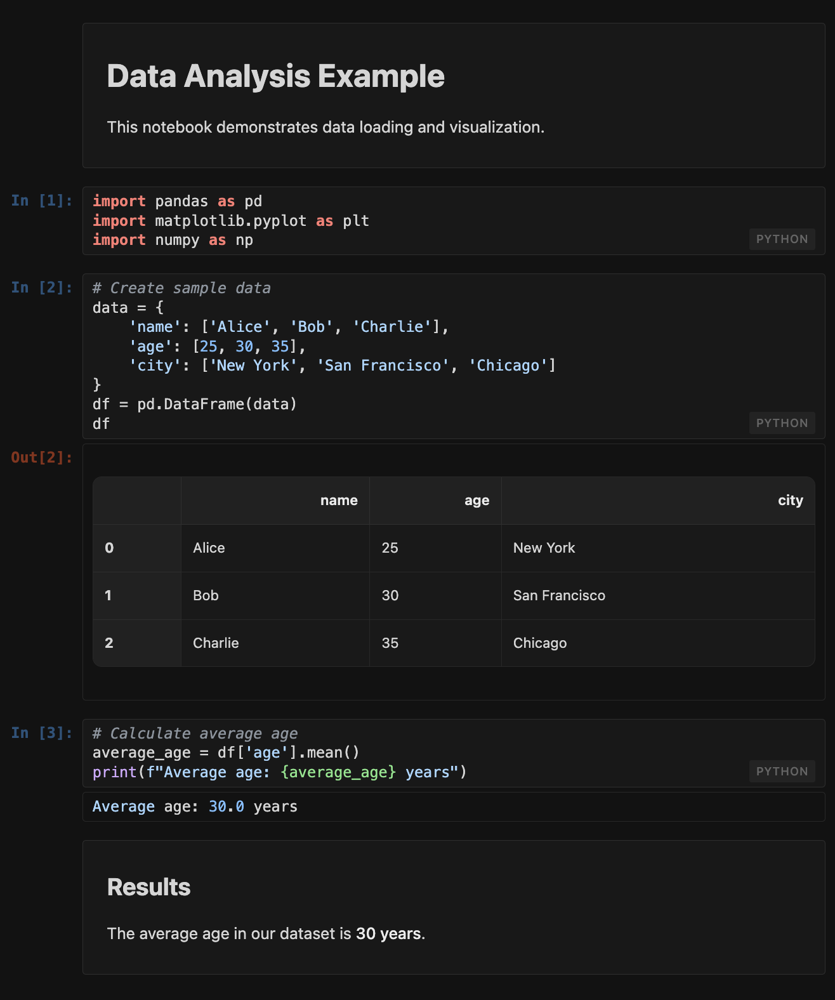

# notebook-mdx

<div align="center">


**Render Jupyter notebooks in MDX with authentic styling and syntax highlighting**

[](https://www.npmjs.com/package/notebook-mdx)
[](https://www.npmjs.com/package/notebook-mdx)
[](https://bundlephobia.com/package/notebook-mdx)
[](https://github.com/abhay-ramesh/notebook-mdx)
[](https://www.typescriptlang.org/)
[](https://opensource.org/licenses/MIT)

[Documentation](https://notebook-mdx.vercel.app) • [Demo](https://notebook-mdx.vercel.app/notebook-demo) • [NPM](https://www.npmjs.com/package/notebook-mdx) • [GitHub](https://github.com/abhay-ramesh/notebook-mdx)

</div>

## ✨ Features

- 🎨 **Authentic Jupyter styling** - Pixel-perfect recreation of Jupyter notebook appearance
- 🖥️ **Syntax highlighting** - Multi-language code highlighting with Highlight.js  
- 📱 **Responsive design** - Looks great on desktop, tablet, and mobile
- ⚡ **Zero client-side dependencies** - Renders at build time for optimal performance
- 🔧 **Framework agnostic** - Works with Next.js, Docusaurus, Fumadocs, and more
- 📦 **TypeScript support** - Full type safety out of the box
- 🎯 **Simple API** - Just import and render, no complex configuration
- 🔄 **Multi-language cells** - Python, R, JavaScript, SQL, and more
- 🖼️ **Rich outputs** - Images, HTML, JSON, and text outputs
- 📋 **Copy-paste ready** - Code cells with built-in copy functionality

## 🚀 Quick Start

### Installation

```bash
npm install notebook-mdx
# or
yarn add notebook-mdx
# or
pnpm add notebook-mdx
```

### Basic Usage

```mdx
import { NotebookLoader, NotebookStyles } from 'notebook-mdx';
import notebook from './my-notebook.ipynb';

# My Data Analysis

<NotebookStyles />
<NotebookLoader notebookData={JSON.parse(notebook)} />
```

### Next.js Setup

Add to your `next.config.js`:

```javascript
module.exports = {
  webpack: (config) => {
    config.module.rules.push({
      test: /\.ipynb$/,
      type: 'json',
      use: 'raw-loader',
    });
    return config;
  },
};
```

## 📖 Documentation

- **[Getting Started](https://notebook-mdx.vercel.app)** - Installation and basic usage
- **[Advanced Usage](https://notebook-mdx.vercel.app/advanced)** - Multi-language support and configuration
- **[API Reference](https://notebook-mdx.vercel.app/api)** - Complete component props and options
- **[Live Demo](https://notebook-mdx.vercel.app/notebook-demo)** - Interactive examples

## 🎯 Use Cases

### 📚 Technical Documentation

Perfect for data science blogs, tutorials, and educational content where you want to show Jupyter notebooks inline with your documentation.

### 🔬 Research Papers

Embed computational notebooks directly in academic papers and research documentation.

### 📊 Data Science Portfolios

Showcase your data analysis projects with authentic notebook styling in your portfolio site.

### 🏢 Internal Documentation

Document data pipelines, analysis workflows, and research findings in company wikis and documentation sites.

## 🌟 Why notebook-mdx?

| Feature | notebook-mdx | Alternatives |
|---------|-------------|--------------|
| **Authentic Styling** | ✅ Pixel-perfect Jupyter look | ❌ Generic code blocks |
| **Zero Runtime** | ✅ Renders at build time | ❌ Client-side rendering |
| **TypeScript** | ✅ Full type safety | ❌ Limited or no types |
| **Framework Support** | ✅ Works everywhere | ❌ Framework-specific |
| **Bundle Size** | ✅ ~15kB minzipped | ❌ Often 100kB+ |
| **Maintenance** | ✅ Actively maintained | ❌ Many are abandoned |

## 🖼️ Screenshots

<table>
<tr>
<td width="50%" align="center">

### Before (Plain Markdown)

*Generic code blocks with basic syntax highlighting*



</td>
<td width="50%" align="center">

### After (notebook-mdx)

*Authentic Jupyter styling with In/Out prompts*



</td>
</tr>
</table>

## 🔧 Framework Examples

<details>
<summary><strong>Next.js App Router</strong></summary>

```mdx
// app/blog/my-analysis/page.mdx
import { NotebookLoader, NotebookStyles } from 'notebook-mdx';
import notebook from './analysis.ipynb';

export const metadata = {
  title: 'My Data Analysis',
  description: 'Deep dive into user behavior data'
};

# My Data Analysis

<NotebookStyles />
<NotebookLoader notebookData={JSON.parse(notebook)} />
```

</details>

<details>
<summary><strong>Docusaurus</strong></summary>

```mdx
---
title: Machine Learning Tutorial
---

import { NotebookLoader, NotebookStyles } from 'notebook-mdx';
import notebook from './tutorial.ipynb';

# Machine Learning Tutorial

<NotebookStyles />
<NotebookLoader notebookData={JSON.parse(notebook)} />
```

</details>

<details>
<summary><strong>Fumadocs</strong></summary>

```mdx
---
title: API Documentation
description: Complete guide to our data API
---

import { NotebookLoader, NotebookStyles } from 'notebook-mdx';
import examples from './api-examples.ipynb';

<NotebookStyles />
<NotebookLoader notebookData={JSON.parse(examples)} />
```

</details>

## 🏗️ Development

```bash
# Clone the repository
git clone https://github.com/abhay-ramesh/notebook-mdx.git
cd notebook-mdx

# Install dependencies
pnpm install

# Start development
pnpm dev

# Run tests
pnpm test

# Build packages
pnpm build
```

## 🤝 Contributing

We welcome contributions! Please see our [Contributing Guide](CONTRIBUTING.md) for details.

- 🐛 [Report bugs](https://github.com/abhay-ramesh/notebook-mdx/issues/new?template=bug_report.md)
- 💡 [Request features](https://github.com/abhay-ramesh/notebook-mdx/issues/new?template=feature_request.md)
- 📖 [Improve docs](https://github.com/abhay-ramesh/notebook-mdx/tree/main/apps/docs)
- 🔧 [Submit PRs](https://github.com/abhay-ramesh/notebook-mdx/pulls)

## 🙏 Acknowledgments

- [Jupyter Project](https://jupyter.org/) for the amazing notebook format
- [Highlight.js](https://highlightjs.org/) for syntax highlighting
- [MDX](https://mdxjs.com/) for making this integration possible

## 📄 License

MIT © [Abhay Ramesh](https://github.com/abhay-ramesh)

---

<div align="center">

**[⭐ Star this repo](https://github.com/abhay-ramesh/notebook-mdx) if notebook-mdx helped you!**

Made with ❤️ by [@abhay-ramesh](https://github.com/abhay-ramesh)

</div>
