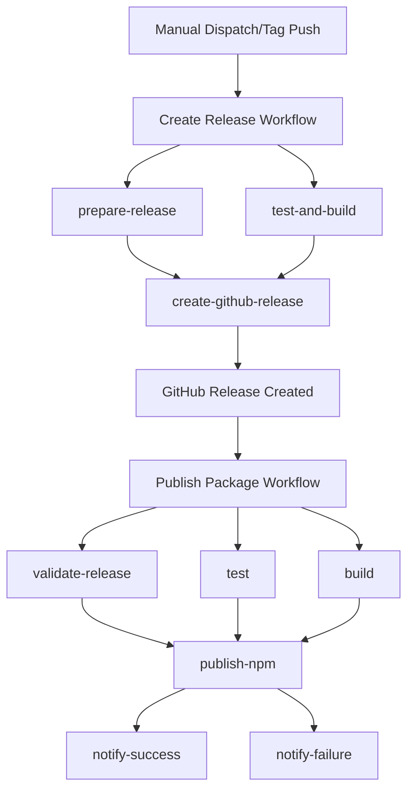

# Enhanced Release Workflows

This project uses a sophisticated two-stage release system that separates release creation from package publishing, providing better control, validation, and error handling.

## 🎯 Overview

### Two-Stage Process

1. **Create Release** (`.github/workflows/release.yml`)
   - Manual dispatch or automatic on tag push
   - Version bumping and validation
   - Creates GitHub releases
   - Supports dry runs

2. **Publish Package** (`.github/workflows/publish.yml`)
   - Triggered by GitHub releases or manual dispatch
   - Builds, tests, and publishes to NPM
   - Enhances release notes with contributors
   - Handles failures gracefully

## 🚀 Usage

### Method 1: Manual Dispatch (Recommended)

1. Go to **Actions** → **Create Release** → **Run workflow**
2. Choose options:
   - **Version type**: `patch`, `minor`, `major`, or `prerelease`
   - **Prerelease tag**: `beta`, `alpha`, `rc` (for prereleases)
   - **Dry run**: Test without creating actual release

3. The workflow will:
   - Calculate new version
   - Run tests and validation
   - Create git tag and GitHub release
   - Automatically trigger NPM publishing

### Method 2: Git Tag Push (Legacy)

```bash
git tag v1.2.3
git push origin v1.2.3
```

This automatically creates a GitHub release and triggers publishing.

## 🔧 Required Setup

### 1. Repository Secrets

Add these secrets in **Settings** → **Secrets and variables** → **Actions**:

#### NPM_TOKEN (Required)

```bash
# Create NPM token with publish permissions
npm login
npm token create --type=granular --scope=@your-scope
```

#### PAT_TOKEN (Recommended)

For bypassing branch protection rules:

1. Go to [GitHub Settings → Personal Access Tokens](https://github.com/settings/tokens)
2. Create token with `repo` permissions
3. Add as repository secret named `PAT_TOKEN`
4. Token owner must have admin permissions on repository

### 2. Branch Protection (Optional)

If you have branch protection on `main`, the PAT_TOKEN is required for the workflow to push version updates and tags.

## 📋 Workflow Features

### Release Creation Workflow

- ✅ **Manual version bumping** with semantic versioning
- ✅ **Dry run capability** for testing
- ✅ **Comprehensive validation** (tests, typecheck, lint)
- ✅ **Automatic changelog generation** from commits
- ✅ **Branch protection bypass** with PAT token
- ✅ **Concurrency control** to prevent conflicts

### Publishing Workflow

- ✅ **Duplicate publication detection** prevents errors
- ✅ **Build artifact management** for reliability
- ✅ **Bundle size analysis** in workflow summary
- ✅ **NPM provenance** for supply chain security
- ✅ **Enhanced release notes** with contributor avatars
- ✅ **Automatic failure notifications** via GitHub issues
- ✅ **Prerelease tag detection** (beta, alpha, rc)

## 🔍 Monitoring

### Success Indicators

- ✅ Workflow summary shows package URLs
- ✅ Release notes include NPM links and contributors
- ✅ Repository topics are updated automatically

### Failure Handling

- 🚨 Automatic issue creation with debugging info
- 🚨 Manual recovery commands provided
- 🚨 Retry-safe duplicate detection

## 📦 Version Types

| Type | Example | Description |
|------|---------|-------------|
| `patch` | 1.0.0 → 1.0.1 | Bug fixes, patches |
| `minor` | 1.0.0 → 1.1.0 | New features, backwards compatible |
| `major` | 1.0.0 → 2.0.0 | Breaking changes |
| `prerelease` | 1.0.0 → 1.0.1-beta.0 | Pre-release versions |

## 🐛 Troubleshooting

### Common Issues

#### "PAT_TOKEN required" error

- Add PAT_TOKEN secret with repo permissions
- Ensure token owner has admin access

#### "NPM_TOKEN authentication failed"

- Verify NPM_TOKEN is valid and has publish permissions
- Check token scope includes your package

#### "Version already exists" warning

- This is normal for workflow retries
- The workflow will skip duplicate publication safely

#### Build artifacts missing

- Check if `pnpm build` completes successfully
- Verify `packages/notebook-mdx/dist/` contains expected files

### Manual Recovery

If workflows fail, you can publish manually:

```bash
# 1. Update version
cd packages/notebook-mdx
npm version 1.2.3 --no-git-tag-version

# 2. Build package
pnpm build

# 3. Publish to NPM
npm publish

# 4. Create git tag (if needed)
git tag v1.2.3
git push origin v1.2.3
```

## 🔗 Workflow Dependencies



## 📚 Best Practices

1. **Use dry runs** for testing changes
2. **Test prereleases** before stable releases  
3. **Monitor workflow summaries** for bundle size changes
4. **Check contributor avatars** in release notes
5. **Keep PAT_TOKEN updated** and secure

## 🚀 Example Release Process

```bash
# 1. Manual dispatch workflow
# Actions → Create Release → Run workflow
# - Version type: minor
# - Dry run: true (first time)

# 2. Review dry run results
# Check workflow summary for version changes

# 3. Run for real
# Same inputs but dry run: false

# 4. Monitor publishing
# Publishing workflow triggers automatically
# Check NPM and GitHub release for updates
```
